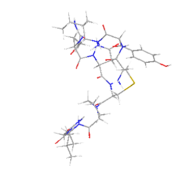

# 🧬 Multi-Omics ML: Cancer Drug Response Predictor

**A dual-phase machine learning framework for predicting cancer drug responses and discovering actionable clinical biomarkers.**

## 📌 Project Overview
Precision oncology relies on accurately predicting patient-specific responses to diverse anti-cancer therapies. This project proposes a robust, two-phase machine learning framework to predict drug efficacy ($log_2AUC$) while overcoming the "black-box" limitations of traditional ensemble models. 

By integrating **biological transcriptomics** with **chemical topologies**, this pipeline simulates precision medicine for unseen patients and extracts highly interpretable biomarkers for targeted therapies.

  

## 🗄️ Data Sources & Preprocessing
This project utilizes large-scale pharmacogenomic data:
* **PRISM Repurposing Dataset:** Provided the target drug sensitivity profiles ($log_2AUC$).
* **Cancer Dependency Map (DepMap):** Provided the baseline transcriptomic profiles (RNA-seq) of cancer cell lines.
* 🔗 **Data Access:** The raw datasets can be downloaded directly from the [DepMap Public Portal](https://depmap.org/portal/download/).

**Feature Engineering:**
* **Biological Pathways:** High-dimensional RNA data was transformed into 300 actionable KEGG pathways using **ssGSEA** (Single-Sample Gene Set Enrichment Analysis).
* **Chemical Topologies:** Drug SMILES strings were converted into **Morgan Fingerprints** using RDKit to capture structural toxicity.

## 🚀 Experimental Workflow & Results

### Phase 1: Pan-Cancer Precision Medicine (XGBoost)
* **Objective:** Predict drug responses for completely new, unseen cell lines.
* **Method:** Trained an `XGBoost Regressor` using a strict `GroupShuffleSplit` (leave-cell-line-out) cross-validation to prevent data leakage.
* **Results:** Achieved high generalized accuracy (**$R^2 = 0.7076$**, **PCC = 0.8420**). 
* **Insight:** Feature importance revealed a heavy dominance of chemical topologies (Morgan Fingerprints) in dictating generalized cell death across diverse treatments.

### Phase 2: Single-Drug Biomarker Discovery (Ridge Regression)
* **Objective:** Extract interpretable biological mechanisms for a specific targeted compound (BRD-K15179879).
* **Method:** Applied a regularized `Ridge Regression` model exclusively on ssGSEA pathways, bypassing the chemical dominance of Phase 1.
* **Results:** Successfully extracted actionable biomarkers. 
* **Insight:** Identified `gabaergic_synapse` as a key pathway conferring cellular sensitivity, and `phototransduction` as the primary driver of drug resistance.

## 🛠️ Repository Structure
* `Data_Preprocessing_and_EDA.ipynb`: Data merging, ssGSEA integration, and Morgan Fingerprint generation.
* `Model_Training_and_Evaluation.ipynb`: XGBoost pan-cancer training, strict cross-validation, and Ridge regression for biomarker extraction.
*(Note: Raw CSV datasets from DepMap and PRISM are not included in this repository due to size constraints. Please download them directly from the Broad Institute portals if reproducing the code).*

## ⚙️ Installation & Usage

To reproduce this project locally, ensure you have the following libraries installed in your Python environment:

`pip install pandas numpy scikit-learn xgboost rdkit seaborn matplotlib`

**Step-by-Step Guide:**
1. Clone this repository to your local machine.
2. Download the raw `PRISM` and `DepMap` datasets directly from the [DepMap Public Portal](https://depmap.org/portal/download/).
3. Run `Data_Preprocessing_and_EDA.ipynb` first to process the raw data, generate ssGSEA pathways, and create Morgan Fingerprints.
4. Run `Model_Training_and_Evaluation.ipynb` to train the XGBoost and Ridge regression models, and to visualize the extracted biomarkers.

## 💡 Conclusion
While complex ensemble models excel at generalized predictions driven by chemical structures, integrating biologically meaningful pathway transformations (ssGSEA) with interpretable linear models is essential for extracting actionable insights for combination therapies in clinical oncology.
